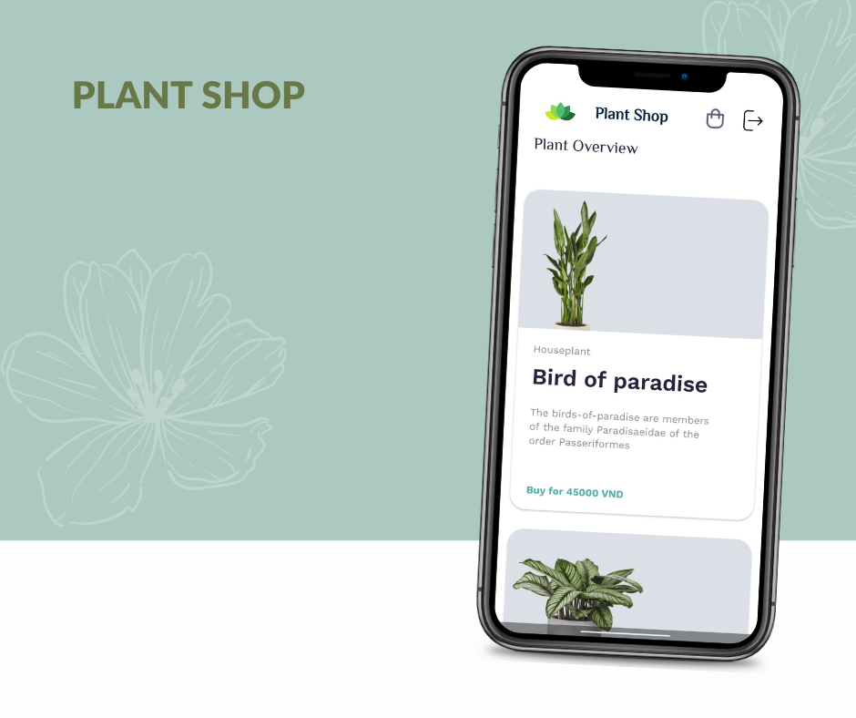
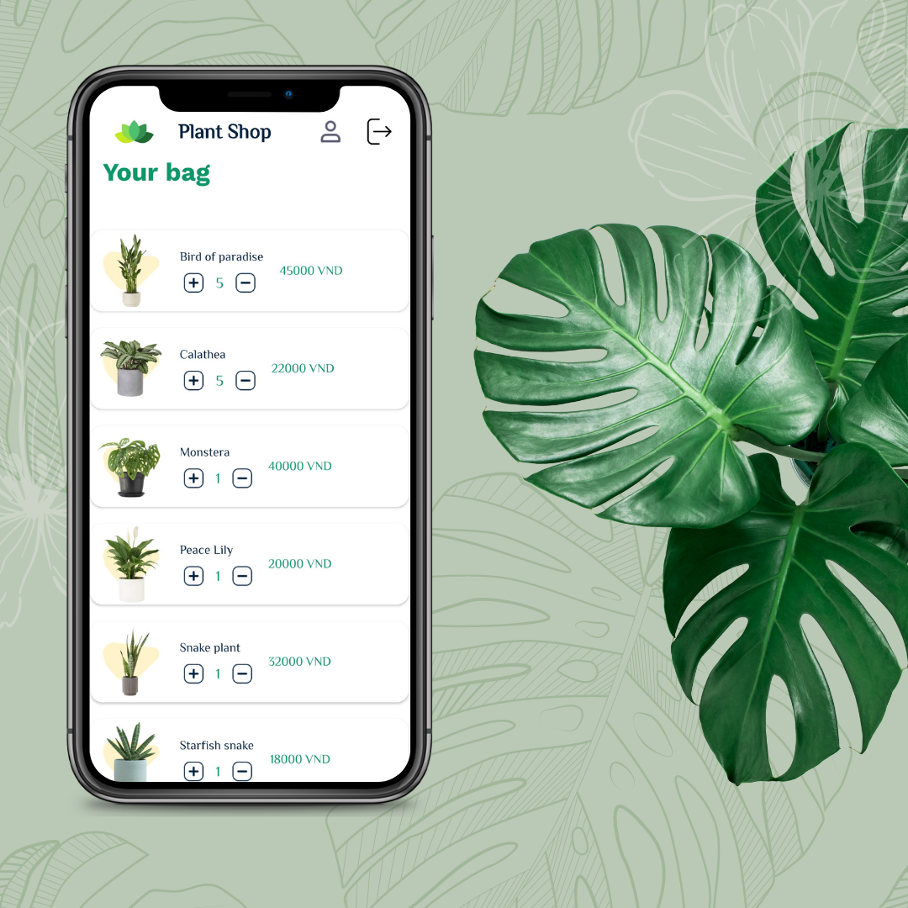
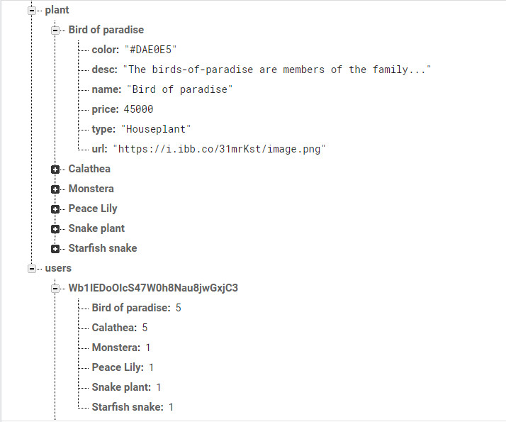

# PlantShop

## Author

* Pradeep

## Description

* A ecommerce plant shop app that enables users to buy plants easily and quickly. The app has been built with Firebase, making it a fast and secure platform for users to purchase plants. It also has a modern and minimal design, which makes it visually appealing and easy to use.  

### Prerequisites

* To run this software, you need an editor with java support, java - version 11 or higher,android-studio
* Install java 11 using the commands:
`sudo apt update`
`sudo apt install openjdk-11-jre-headless`
* Install android-studio
`sudo snap install android-studio --classic`

### Setup

* Clone the project
* Open in android-studio

## Technologies Used

* Java (version 11)
* Android 
* Gradle (7.1)
* Firebase Realtime Storage, Firebase Auth

## Demo image

